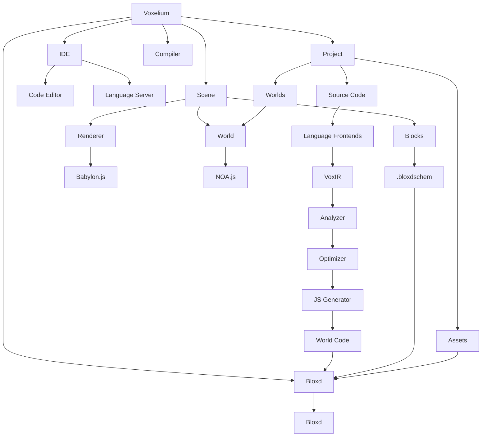
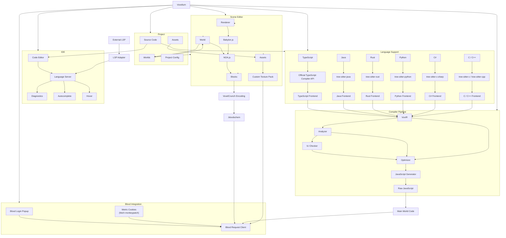

# Voxelium

# Simple idea

```mermaid
flowchart TD
    Voxelium

    Voxelium --> IDE
    Voxelium --> Project
    Voxelium --> Compiler
    Voxelium --> Scene
    Voxelium --> Bloxd

    IDE --> Editor["Code Editor"]
    IDE --> LSP["Language Server"]

    Project --> Source["Source Code"]
    Project --> Worlds["Worlds"]
    Project --> Assets["Assets"]

    Source --> Frontends["Language Frontends"]
    Frontends --> VoxIR["VoxIR"]

    VoxIR --> Analyzer
    Analyzer --> Optimizer
    Optimizer --> JSGen["JS Generator"]
    JSGen --> WorldCode["World Code"]

    Scene --> Renderer
    Scene --> World
    Scene --> Blocks

    Renderer --> Babylon["Babylon.js"]
    World --> NOA["NOA.js"]

    Blocks --> Schem[".bloxdschem"]
    Worlds --> World

    WorldCode --> Bloxd
    Schem --> Bloxd
    Assets --> Bloxd

    Bloxd --> BloxdAPI["Bloxd"]
```

```mermaid
flowchart TD
    Root[Voxelium]

    %% =========================
    %% IDE
    %% =========================

    Root --> IDE

    subgraph IDE["IDE"]
        Editor["Code Editor"]
        LanguageServer["Language Server"]
        Diagnostics["Diagnostics"]
        AutoComplete["Autocomplete"]
        Hover["Hover"]
    end

    Editor --> LanguageServer
    LanguageServer --> Diagnostics
    LanguageServer --> AutoComplete
    LanguageServer --> Hover

    %% =========================
    %% PROJECT
    %% =========================

    Root --> Project

    subgraph Project["Project"]
        Source["Source Code"]
        Worlds["Worlds"]
        Assets["Assets"]
        Config["Project Config"]
    end

    %% =========================
    %% LANGUAGES
    %% =========================

    Root --> Languages

    subgraph Languages["Language Support"]

        TS["TypeScript"]
        Java["Java"]
        Rust["Rust"]
        Python["Python"]
        CSharp["C#"]
        CCpp["C / C++"]

        TSParser["Official TypeScript Compiler API"]
        JavaParser["tree-sitter-java"]
        RustParser["tree-sitter-rust"]
        PythonParser["tree-sitter-python"]
        CSharpParser["tree-sitter-c-sharp"]
        CParser["tree-sitter-c / tree-sitter-cpp"]

        TSFrontend["TypeScript Frontend"]
        JavaFrontend["Java Frontend"]
        RustFrontend["Rust Frontend"]
        PythonFrontend["Python Frontend"]
        CSharpFrontend["C# Frontend"]
        CFrontend["C / C++ Frontend"]
    end

    TS --> TSParser --> TSFrontend
    Java --> JavaParser --> JavaFrontend
    Rust --> RustParser --> RustFrontend
    Python --> PythonParser --> PythonFrontend
    CSharp --> CSharpParser --> CSharpFrontend
    CCpp --> CParser --> CFrontend

    TSFrontend --> VoxIR
    JavaFrontend --> VoxIR
    RustFrontend --> VoxIR
    PythonFrontend --> VoxIR
    CSharpFrontend --> VoxIR
    CFrontend --> VoxIR

    Source --> Languages

    %% =========================
    %% LSP
    %% =========================

    ExternalLSP["External LSP"]

    ExternalLSP --> LSPAdapter["LSP Adapter"]
    LSPAdapter --> LanguageServer

    %% =========================
    %% COMPILER
    %% =========================

    Root --> Compiler

    subgraph Compiler["Compiler Pipeline"]
        VoxIR["VoxIR"]
        Analyzer["Analyzer"]
        IUChecker["IU Checker"]
        Optimizer["Optimizer"]
        JSGen["JavaScript Generator"]
        RawJS["Raw JavaScript"]
    end

    VoxIR --> Analyzer
    Analyzer --> IUChecker
    IUChecker --> Optimizer
    Analyzer --> Optimizer
    VoxIR --> Optimizer

    Optimizer --> JSGen
    JSGen --> RawJS

    RawJS --> WorldCode["Main World Code"]

    %% =========================
    %% SCENE EDITOR
    %% =========================

    Root --> Scene

    subgraph Scene["Scene Editor"]

        Renderer["Renderer"]
        BabylonJS["Babylon.js"]

        World["World"]
        NoaJS["NOA.js"]

        Blocks["Blocks"]
        SceneAssets["Assets"]
        CustomTexturePack["Custom Texture Pack"]
    end

    Renderer --> BabylonJS
    World --> NoaJS

    BabylonJS --> NoaJS
    NoaJS --> Blocks

    Scene --> Renderer
    Scene --> World
    Scene --> Blocks
    Scene --> SceneAssets
    SceneAssets --> CustomTexturePack

    %% =========================
    %% WORLD / SCHEMATIC
    %% =========================

    Blocks --> VoxelCrunch["VoxelCrunch Encoding"]
    VoxelCrunch --> BloxdSchem[".bloxdschem"]

    Worlds --> Scene
    World --> Worlds

    %% =========================
    %% BLOXD INTEGRATION
    %% =========================

    Root --> BloxdIntegration

    subgraph BloxdIntegration["Bloxd Integration"]

        BloxdLoginPopup["Bloxd Login Popup"]
        MetricCookies["Metric Cookies\n(fetch monkeypatch)"]
        BloxdRequestClient["Bloxd Request Client"]
    end

    BloxdLoginPopup --> BloxdRequestClient
    MetricCookies --> BloxdRequestClient

    BloxdSchem --> BloxdRequestClient
    WorldCode --> BloxdRequestClient
    CustomTexturePack --> BloxdRequestClient

    %% =========================
    %% PROJECT CONNECTIONS
    %% =========================

    Assets --> SceneAssets
    Worlds --> World
    Source --> Editor
```
