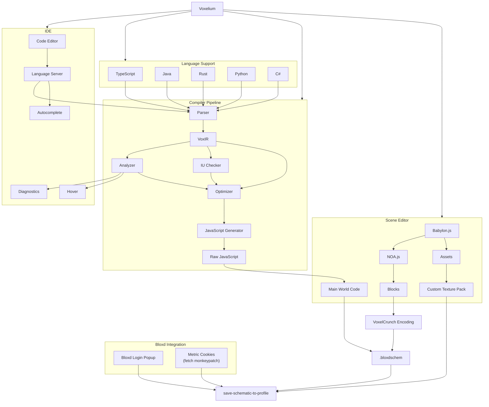

# Voxelium

```mermaid
flowchart TD
    Root[Voxelium]

    Root --> IDE

    subgraph IDE["IDE"]
        Editor["Code Editor"]
        LanguageServer["Language Server"]
        Diagnostics
        AutoComplete["Autocomplete"]
        Hover
    end

    Editor --> LanguageServer
    LanguageServer --> Parser
    Analyzer --> Diagnostics
    Analyzer --> Hover
    LanguageServer --> AutoComplete

    Root --> Languages

    subgraph Languages["Language Support"]
        TS[TypeScript]
        Java
        Rust
        Python
        CSharp[C#]
    end

    TS --> Parser
    Java --> Parser
    Rust --> Parser
    Python --> Parser
    CSharp --> Parser

    Root --> Compiler

    subgraph Compiler["Compiler Pipeline"]
        Parser
        VoxIR
        Analyzer
        IUChecker["IU Checker"]
        Optimizer
        JSGen["JavaScript Generator"]
        RawJS["Raw JavaScript"]
    end

    Parser --> VoxIR

    VoxIR --> Analyzer
    VoxIR --> IUChecker
    VoxIR --> Optimizer

    Analyzer --> Optimizer
    IUChecker --> Optimizer

    Optimizer --> JSGen
    JSGen --> RawJS

    Root --> Scene

    subgraph Scene["Scene Editor"]
        BabylonJS["Babylon.js"]
        NoaJS["NOA.js"]
        WorldCode["Main World Code"]
        Blocks
        Assets
        CustomTexturePack["Custom Texture Pack"]
    end

    BabylonJS --> NoaJS
    BabylonJS --> Assets
    NoaJS --> Blocks
    Assets --> CustomTexturePack

    RawJS --> WorldCode

    Blocks --> VoxelCrunch["VoxelCrunch Encoding"]

    WorldCode --> BloxdSchem[".bloxdschem"]
    VoxelCrunch --> BloxdSchem

    CustomTexturePack --> BloxdReq

    subgraph BloxdPopup["Bloxd Integration"]
        BloxdLoginPopup["Bloxd Login Popup"]
        MetricCookies["Metric Cookies\n(fetch monkeypatch)"]
    end

    BloxdLoginPopup --> BloxdReq
    MetricCookies --> BloxdReq

    BloxdSchem --> BloxdReq["save-schematic-to-profile"]
```
